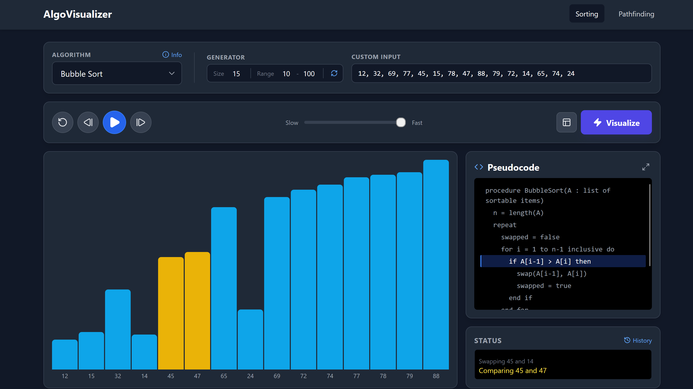
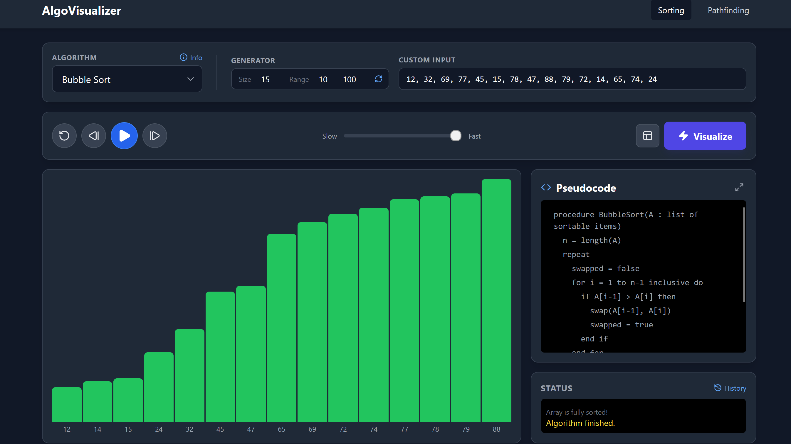
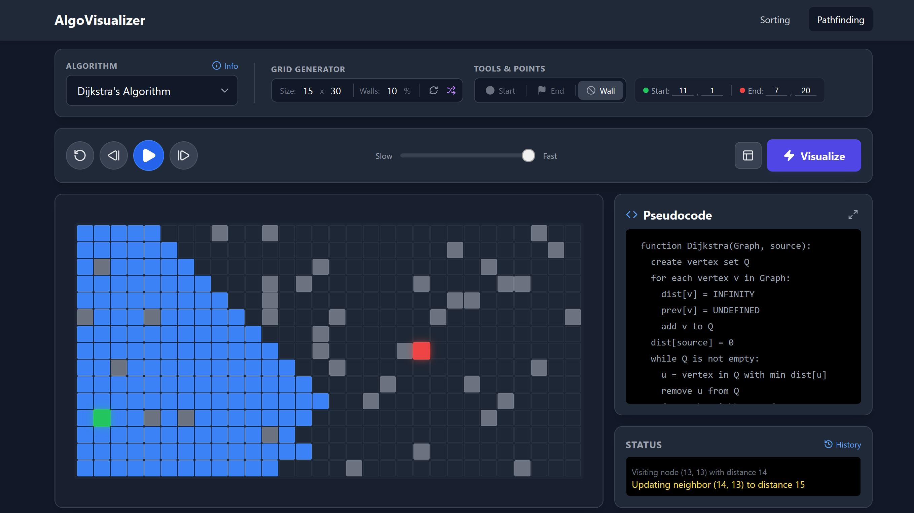
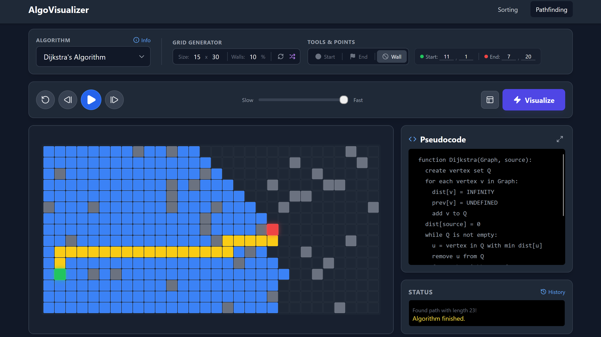

# Algorithm Visualizer

A full-stack web application that brings algorithms to life through real-time, interactive visualizations.

Built with a **React (TypeScript)** frontend and a **FastAPI (Python)** backend, this tool provides an engaging way to explore how algorithms operate step by step.

> **Note:** This application is optimized for **desktop use only**. Due to the complexity of the grid layouts and control panels, many features will not display or function correctly on mobile devices.

---

## 🖼️ Screenshots

| Sorting View | Sorted View |
|:---------:|:------------:|
|  |  |

| Path-Finding View | Path-Found View |
|:---------:|:------------:|
|  |  |

---

## ✨ Features

### 🔴 Real-Time Visualization

Algorithm execution steps are streamed from the backend using **WebSockets**, enabling smooth, animated playback.

### 🧩 Supported Categories

**Sorting Algorithms**

* Bubble Sort
* Selection Sort
* Insertion Sort

**Pathfinding Algorithms**

* Dijkstra’s
* Breadth-First Search (BFS)
* Depth-First Search (DFS)

### 🎛️ Interactive Controls

* Playback: Play, Pause, Step Forward/Backward, Reset, Speed Control
* **Grid Tools:** Draw walls, reposition start/end nodes, random maze generation
* **Array Tools:** Generate random arrays or input your own values

### 📚 Dynamic Panels

* **Pseudocode Panel:** Highlights the active line in real-time
* **Status Log:** Scrollable history of all operations
* **Info Modal:** Complexity, strengths, and limitations for each algorithm

### 🎨 Modern UI

Built with **TailwindCSS** for a clean, responsive, dashboard-style design.

---

## 🛠️ Tech Stack

### Frontend

* React (TypeScript)
* Vite
* TailwindCSS
* Lucide Icons

### Backend

* FastAPI
* Python
* Uvicorn (ASGI)

---

## 🚀 Getting Started

### Prerequisites

* **Node.js** v18 or newer
* **Python** v3.8 or newer
* `pip` or `uv`

---

### 1. Clone the Repository

```bash
git clone https://github.com/qtremors/algorithm-visualizer.git
cd algorithm-visualizer
```

---

### 2. Backend Setup

```bash
# Navigate to backend
cd backend

# Create & activate virtual environment
python -m venv .venv
# Windows: .venv\Scripts\activate
# macOS/Linux: source .venv/bin/activate

# Install dependencies
pip install -r requirements.txt

# Run the backend server
uvicorn app.main:app --reload
```

Backend runs at: **[http://127.0.0.1:8000](http://127.0.0.1:8000)**

---

### 3. Frontend Setup

Open a new terminal:

```bash
cd frontend

npm install
npm run dev
```

Frontend runs at: **[http://localhost:5173](http://localhost:5173)**

---

## ▶️ Using the App

Visit **[http://localhost:5173](http://localhost:5173)** in your browser to start visualizing algorithms.

---

## 🏗️ Architecture Overview

### Backend (Execution Engine)

Each algorithm is implemented as a Python class inheriting from `BaseAlgorithm`.
Its `run()` method acts as a **generator**, yielding structured step-by-step data (e.g., comparisons, swaps, node visits).
This allows new algorithms to be added without modifying the core API.

### Frontend (Visualizer Framework)

The React app uses **metadata-driven** rendering:

* Fetches algorithm definitions from the backend
* Loads the appropriate input components (array/grid)
* Renders the correct visualization (bars/grid)

### Communication

WebSockets maintain a persistent connection to stream algorithm steps in real-time.

---

## 🗺️ Roadmap

* **Algorithm Comparison Mode:** Run two algorithms side-by-side
* **More Algorithms:**

  * Merge Sort
  * Quick Sort
  * A* Search
* **Data Structure Visualizations:**

  * Binary Trees
  * Linked Lists

---
