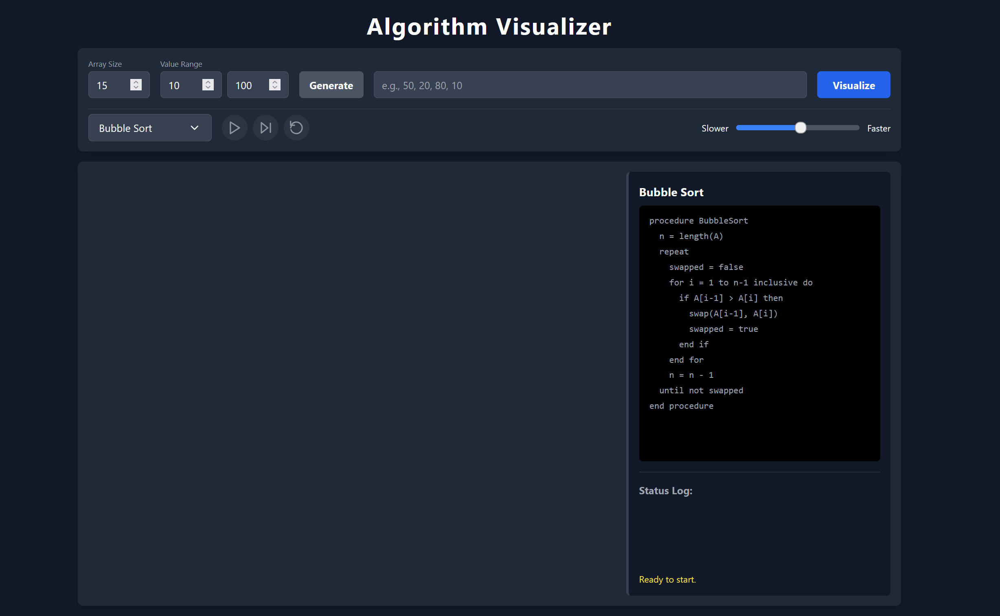
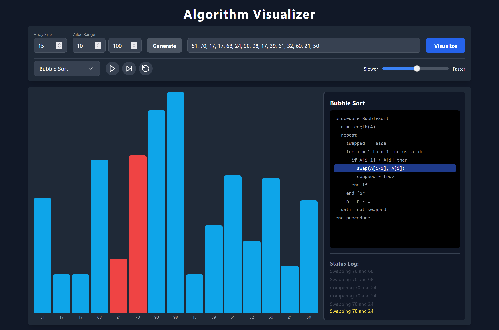
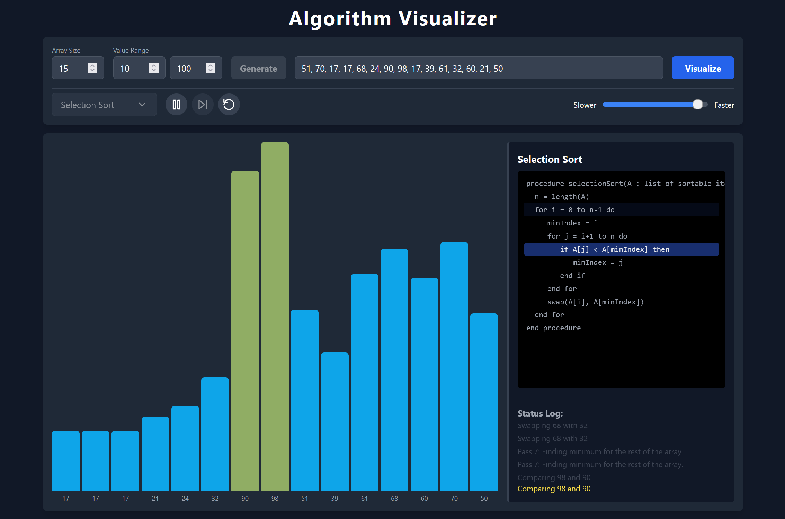
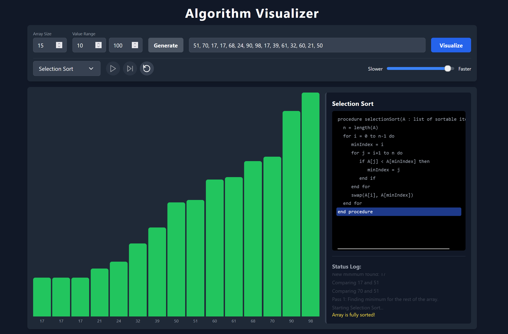

# Algorithm Visualizer

A **full-stack web application** designed to bring algorithms to life through **real-time, interactive visualizations**.  
Built with a **React (TypeScript)** frontend and a **Python (FastAPI)** backend, this tool provides an engaging way to understand how different algorithms operate step by step.

### 🖼️ Screenshots

| | |
|:---:|:---:|
|  | 
|  | |
|  | |

---

## ✨ Key Features
- **Real-Time Visualization**: Algorithm execution steps are streamed from the backend via WebSockets for smooth, animated experiences.
- **Multiple Sorting Algorithms**: Supports **Bubble Sort** and **Selection Sort** with an extensible design for adding more.
- **Interactive Controls**: Play, Pause, Next Step, Reset, and adjustable speed slider.
- **Dynamic Pseudocode**: Highlights relevant pseudocode lines in sync with the visualization.
- **User-Defined Data**: Generate random arrays with custom size and value ranges or input your own data.
- **Responsive Design**: Clean, modern UI built with TailwindCSS for desktop and mobile.
- **Live Status Log**: Tracks each algorithm step, with the most recent at the top.

---

## 🛠️ Tech Stack
This is a **monorepo** containing two main parts:

### **Frontend**
- Framework: **React (TypeScript)**
- Build Tool: **Vite**
- Styling: **TailwindCSS**

### **Backend**
- Framework: **FastAPI**
- Server: **Uvicorn (ASGI)**
- Language: **Python**

---

## 🚀 Getting Started

### **Prerequisites**
- **Node.js** (v18 or newer)
- **Python** (v3.8 or newer) and `pip`

---

### **Installation & Setup**

#### 1. Clone the Repository:
```bash
git clone https://github.com/qtremors/algorithm-visualizer.git
cd algorithm-visualizer
```

#### 2. Setup the Backend:
```bash
# Navigate to the backend directory
cd backend

# Create and activate a virtual environment
python -m venv venv
# On Windows: venv\Scripts\activate
# On macOS/Linux: source venv/bin/activate

# Install required Python packages
pip install -r requirements.txt

# Start the backend server
uvicorn app.main:app --reload
```
The backend will be running at **http://127.0.0.1:8000**.

---

#### 3. Setup the Frontend:
(Open a new terminal)
```bash
# Navigate to the frontend directory
cd frontend

# Install npm packages
npm install

# Start the frontend development server
npm run dev
```
The frontend will be running at **http://localhost:5173**.

---

### **Open the App**
Navigate to **http://localhost:5173** in your browser to start using the application.

---

## 🏗️ How It Works
- **Algorithm Logic**: Each algorithm on the backend is a Python class inheriting from `BaseAlgorithm`. The `run()` method is a generator that yields a dictionary for each step (e.g., comparison or swap).
- **WebSocket Streaming**: When the user clicks "Visualize," the frontend opens a WebSocket connection. The backend streams each step in real-time.
- **Frontend Animation**: The React frontend queues steps and uses `requestAnimationFrame` to animate them at user-controlled speed, updating bars, highlighting pseudocode, and logging actions.

---

## 🗺️ Future Roadmap
- **📈 Algorithm Comparison Mode**: Visualize two algorithms side by side on the same dataset.
- **🌳 More Algorithms & Data Structures**:
    - Sorting: Insertion Sort, Merge Sort, Quick Sort
    - Graph: BFS, DFS, Dijkstra's Algorithm
    - Data Structures: Trees, Linked Lists, Hash Tables
- **🎬 Export Visualizations**: Export animations as GIF or video for sharing.
- **🤝 Collaborative Sessions**: Allow multiple users to watch a visualization together in real time.

---

## 🙌 Contributing
Contributions are welcome!  
If you have an idea for a feature or found a bug, open an issue or submit a pull request.

1. **Fork the Project**
2. **Create a Feature Branch**
   ```bash
   git checkout -b feature/AmazingFeature
   ```
3. **Commit Your Changes**
   ```bash
   git commit -m 'Add some AmazingFeature'
   ```
4. **Push to the Branch**
   ```bash
   git push origin feature/AmazingFeature
   ```
5. **Open a Pull Request**

---

### ⭐ Show Your Support
If you like this project, consider giving it a **star** on GitHub!

