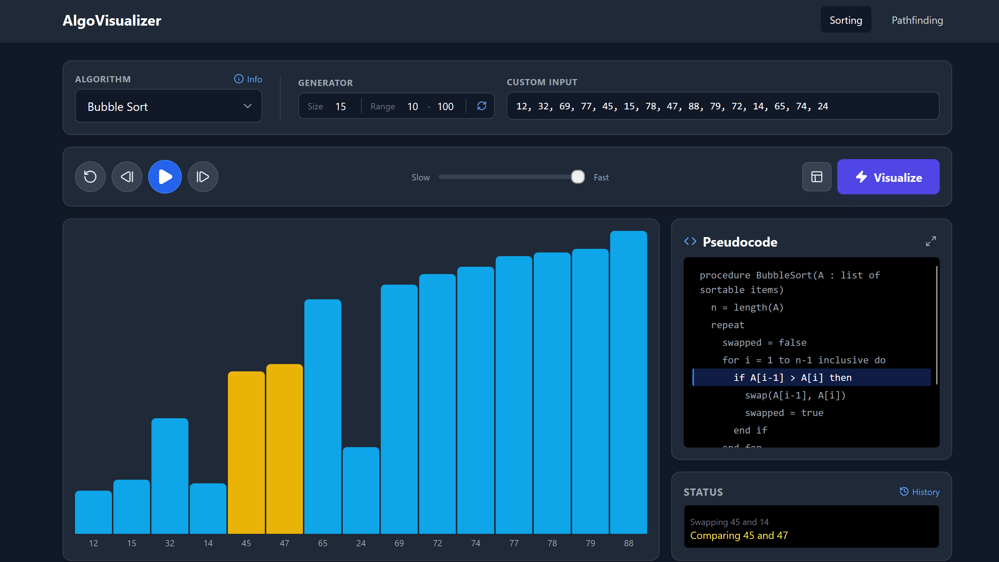
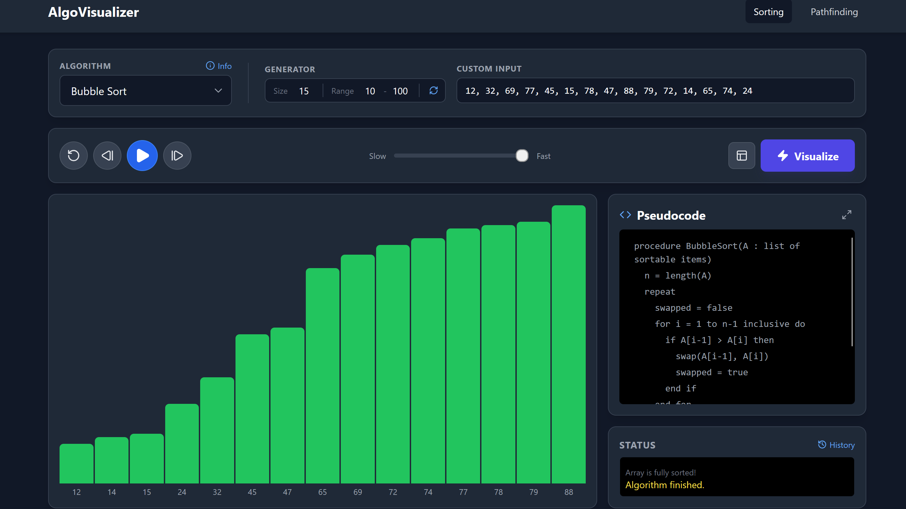
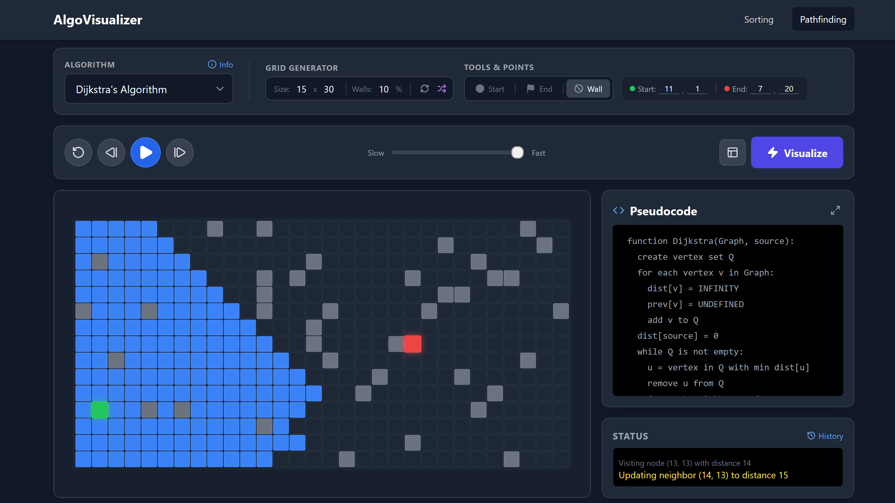
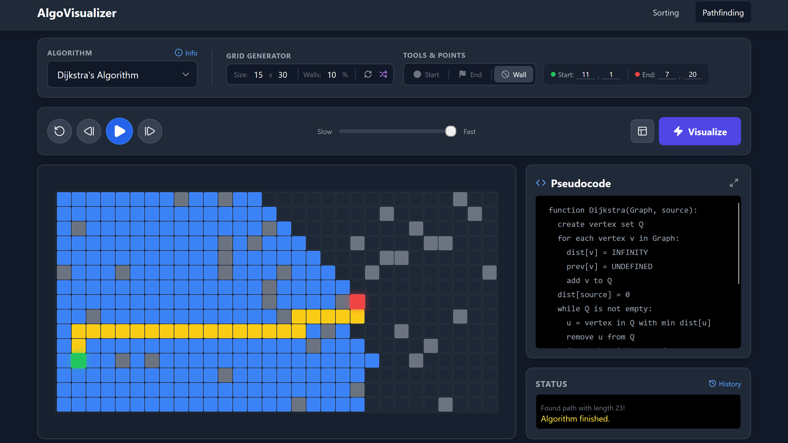

# AlgoVisualizer

**AlgoVisualizer** is a high-performance, interactive educational platform designed to demystify complex algorithms. By visualizing execution steps in real-time, it bridges the gap between abstract code and tangible logic.

Built with a **FastAPI (Python)** backend for robust execution logic and a **React (TypeScript)** frontend for a responsive, modern UI, this project leverages **WebSockets** to stream algorithm states frame-by-frame.

> **Note:** This application is optimized for **desktop use only**. Due to the complexity of the grid layouts and control panels, mobile support is limited.

---

## 🖼️ Screenshots

| Sorting View | Sorted View |
|:---------:|:------------:|
|  |  |

| Path-Finding View | Path-Found View |
|:---------:|:------------:|
|  |  |

---

## ⚡ Real-Time Execution

Unlike traditional visualizers that pre-calculate steps, AlgoVisualizer runs algorithms live on the backend.

- **WebSocket Streaming:** The backend yields execution states (comparisons, swaps, path visits) which are streamed instantly to the frontend.
- **VCR-Style Controls:** Play, Pause, Step Forward, Step Backward, and Reset execution at any point.
- **Variable Speed:** Adjust playback speed from 10ms (near instant) to 1000ms (slow motion) to follow complex logic.

### 📊 Sorting Algorithms
Visualize how different strategies sort data arrays.
- **Algorithms:** Bubble Sort, Selection Sort, Insertion Sort.
- **Custom Input:** Type your own comma-separated list of numbers.
- **Random Generator:** Generate arrays with custom size (5-100) and value ranges.
- **Visuals:** Color-coded bars indicate comparisons (Yellow), swaps (Red), and sorted elements (Green).

### 🕸️ Pathfinding Algorithms
Navigate through complex 2D grids and graph networks.
- **Algorithms:** Dijkstra's Algorithm, Breadth-First Search (BFS), Depth-First Search (DFS).
- **Dual Views:**
    - **Grid View:** A tile-based interactive map. Draw walls, move start/end nodes, and resize the grid.
    - **Graph View:** A node-link diagram. Add nodes, connect edges with custom weights, and auto-generate layouts.

### 🧠 Educational Tools
- **Pseudocode Tracking:** The active line of code highlights in sync with the visualization.
- **Execution Log:** A scrollable history of every operation (e.g., "Swapping index 4 and 5", "Visiting Node A").
- **Info Modals:** Detailed breakdown of Time Complexity, Space Complexity, Pros, and Cons for every algorithm.

---

## 🛠️ Technology Stack

### Backend (Server)
- **Runtime:** Python 3.11+
- **Framework:** FastAPI
- **Package Manager:** `uv`
- **Protocol:** WebSockets (via `fastapi.websockets`)
- **Design Pattern:** Strategy Pattern (BaseAlgorithm class with polymorphic implementations)

### Frontend (Client)
- **Framework:** React 18 + TypeScript
- **Build Tool:** Vite
- **Styling:** TailwindCSS
- **State Management:** React Context API + Custom Hooks (`usePlayback`)

---

## 🚀 Getting Started

### Prerequisites

1.  **Node.js**: Install Node.js (v18 or higher) for the frontend.
2.  **uv**: This project uses `uv` for ultra-fast Python package management.
    *   **MacOS/Linux:** `curl -LsSf https://astral.sh/uv/install.sh | sh`
    *   **Windows:** `powershell -c "irm https://astral.sh/uv/install.ps1 | iex"`
    *   *Alternatively, install via pip:* `pip install uv`

### Installation

1.  **Clone the repository:**
    ```bash
    git clone https://github.com/StartLedger/algorithm-visualizer.git
    cd algorithm-visualizer
    ```

### Running the Application

This project requires two terminals running simultaneously: one for the backend and one for the frontend.

#### 1. Start the Backend
Navigate to the backend directory and run the server using `uv`. It will automatically handle virtual environment creation and dependency installation.

```bash
cd backend
uv run uvicorn app.main:app --reload
```
*The backend API will be available at `http://localhost:8000`*

#### 2. Start the Frontend
Open a new terminal, navigate to the frontend directory, install dependencies, and start the vite server.

```bash
cd frontend
npm install
npm run dev
```
*The frontend application will be available at `http://localhost:5173`*

---

## 🏗️ Architecture

The project follows a **Metadata-Driven UI** architecture.

1.  **Discovery:** On load, the Frontend fetches the `/api/algorithms` registry. This JSON response dictates which algorithms exist, their inputs (Array vs Grid), and their visualizers.
2.  **Execution:**
    - User clicks "Visualize".
    - Frontend sends the `initial_data` (Array or Adjacency Matrix) via WebSocket.
    - Backend instantiates the specific Algorithm Class.
    - The `run()` method is a **Python Generator** that `yields` a `step` dictionary for every atomic action.
3.  **Rendering:**
    - Frontend receives the stream of steps.
    - `usePlayback` hook buffers them and manages the "current frame" index.
    - Visualizers render the state at that specific index.

---

## 🗺️ Roadmap

- [ ] **Algorithm Comparison Mode ("Race Mode"):** Run two algorithms side-by-side.
- [ ] **Procedural Maze Generation:** Recursive Backtracker, Prim's Algorithm.
- [ ] **Expanded Library:** Merge Sort, Quick Sort, A*, Bellman-Ford.
- [ ] **Recursive Data Structures:** BST, AVL Trees.
- [ ] **Session Persistence:** Shareable URLs for specific setups.

---

## 🤝 Contributing

Contributions are welcome! Please feel free to submit a Pull Request.

1.  Fork the project
2.  Create your feature branch (`git checkout -b feature/AmazingFeature`)
3.  Commit your changes (`git commit -m 'Add some AmazingFeature'`)
4.  Push to the branch (`git push origin feature/AmazingFeature`)
5.  Open a Pull Request

---

Designed & Developed by **Tremors** with 💖
